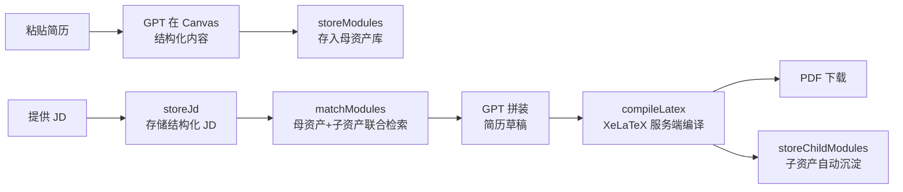
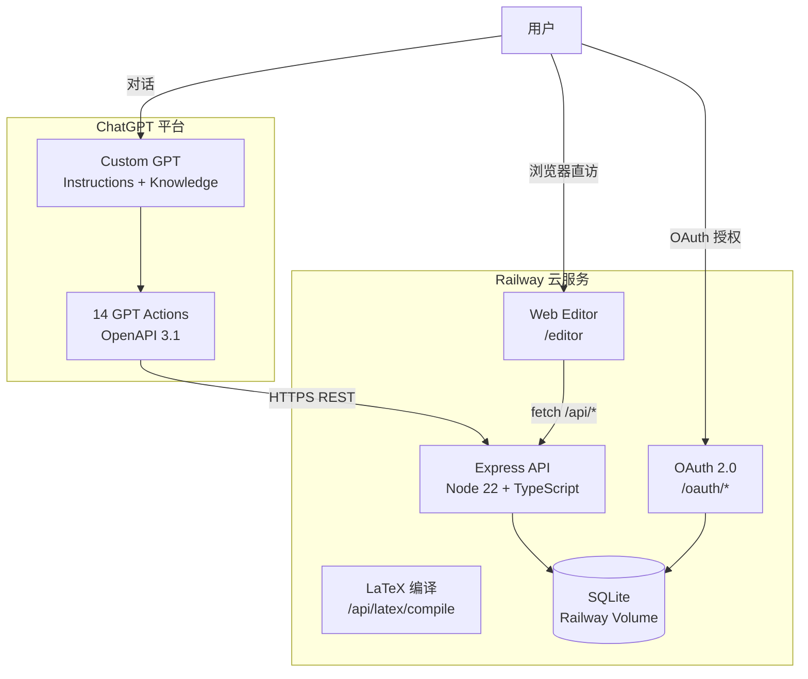
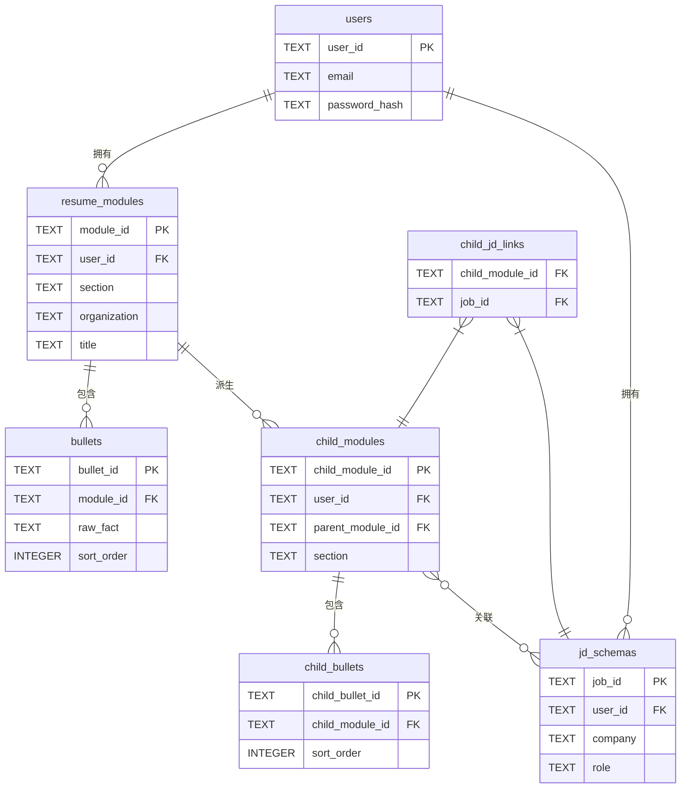

# 简历老中医

> 面向在校生与应届生的 AI 驱动简历优化系统

[](https://nodejs.org)
[](https://railway.app)
[](./LICENSE)

**[→ 立即体验 GPT](https://chatgpt.com/g/g-69df421a0d04819194c2802f0d513260-jian-li-lao-zhong-yi)** · **[经历库 Web UI](https://resume-builder-production-229e.up.railway.app/editor?view=modules)**

---

> **选型考量**：简历老中医采用 ChatGPT Custom GPT + 自建后端的架构，而非直接调用 OpenAI API 或自建对话前端。核心考量：per-query API 费用对个人项目不现实，用户复用已有的 ChatGPT 订阅即可；无需另建完整对话界面，Canvas 协作编辑、Knowledge 知识库、文件上传等能力免费继承；已有 ChatGPT Plus 的用户打开链接即用，链路最短。

---

## 产品简介

**投简历最大的成本不是写，是反复重写。** 每次面对新 JD，用户都要从头改写经历描述；多轮 GPT 对话改写后，表达风格悄然漂移；过去精心打磨的句子，换一份 JD 又得重头来过，经历积累无法沉淀复用。

简历老中医以「模块化经历资产」为核心，解决上述问题：

- **建档一次**：将每段经历拆解为结构化子模块存入母资产库，跨 JD 永久复用
- **智能调取**：提供 JD 后自动检索最匹配的经历模块，省去手动筛选
- **内容沉淀**：每次针对 JD 优化后的内容自动沉淀为子资产，相近岗位直接召回微调
- **一键成稿**：服务端 XeLaTeX 编译，全程不离开 ChatGPT 窗口，输出可下载 PDF

效果：一次建档多 JD 复用，抑制风格漂移，减少重复劳动，降低 token 消耗，缩短生成时延。

---

## 核心能力

| 能力 | 说明 |
|------|------|
| **模块化经历存储（母资产库）** | 每段经历拆为子模块 + bullet 条目，持久存储，可跨 JD 反复调用 |
| **JD 智能匹配** | 基于 tag 重叠评分，联合检索母资产与子资产，子资产享有额外加权 |
| **母/子资产双层架构** | 针对特定 JD 优化后的内容自动沉淀为「子资产」，可关联并复用于相近 JD |
| **服务端 LaTeX 编译** | XeLaTeX + xeCJK，Docker 容器内运行，用户无需本地安装 TeX |
| **中英文双模板** | GPT 按内容语言自动选择模板；中文版采用 Fandol/Noto-CJK 字体 |
| **经历库 Web UI** | 点击编辑、拖拽排序、撤销重做、母资产 / 子资产 / JD 库三 Tab 管理 |

---

## 使用流程



---

## 系统架构

### 组件关系



### 数据模型（ER 图）



### 技术栈

| 层次 | 技术 |
|------|------|
| GPT 接口 | ChatGPT Custom GPT + Actions（OpenAPI 3.1.0，14 个操作） |
| 后端运行时 | Node.js 22、TypeScript、Express.js |
| 数据库 | SQLite（`better-sqlite3`），WAL 模式，Railway Volume 持久化 |
| 认证 | 自建 OAuth 2.0（bcryptjs 哈希，7 天 access token） |
| LaTeX 引擎 | XeLaTeX + texlive-lang-chinese + fonts-noto-cjk |
| 前端编辑器 | React 18、Vite 5、CodeMirror 6 |
| 部署 | Docker 三阶段构建 + Railway |

---

## 即开即用

### 第一步：打开 GPT

**[→ 点击进入简历老中医 GPT](https://chatgpt.com/g/g-69df421a0d04819194c2802f0d513260-jian-li-lao-zhong-yi)**

首次使用时，GPT 会引导完成 OAuth 注册（填写邮箱 + 密码即可，约 30 秒）。

> **推荐模型**：使用 **ChatGPT 5.4**（Thinking Standard 或 Extended Thinking），推理能力更强，JD 理解与模块匹配质量更佳。

---

### 第二步：粘贴一份简历（任选其一）

以下提供 3 份合成测试简历，可直接复制粘贴给 GPT：

<details>
<summary>简历 A — Grace Chen（经济学 / 咨询方向）</summary>

```
Grace Chen
B.A. Economics, Minor in Statistics | Selective Global University | Expected Jun 2027
GPA: 3.78/4.00

Education
- B.A. Economics, Minor in Statistics, Selective Global University, Expected Jun 2027
- Relevant Coursework: Corporate Strategy, Econometrics, Consumer Behavior, Data Analysis for Business

Experience
Strategy Intern — Nova Consumer Group (Jun 2025 – Aug 2025)
- Built a competitor landscape covering 25 beauty brands across pricing, channels, and
  product claims for a China market entry study.
- Synthesized desk research and 12 student consumer interviews into an 18-slide
  recommendation deck used by the project manager in a client workshop.

Student Consultant — Campus Consulting Group (Sep 2024 – Dec 2024)
- Worked in a 4-person team advising a local beverage chain on student acquisition and
  store-level promotion ideas.
- Designed a survey, analyzed 146 student responses, and helped segment users by
  purchase frequency and channel preference.

Leadership / Projects
Research Assistant — Consumer Insights Lab (Jan 2025 – Present)
- Cleaned survey data and coded open-ended responses for a faculty project on Gen Z
  purchase drivers.

Conference Director — Women in Business Society (May 2024 – Present)
- Led a student team organizing a career event for 180+ attendees and 12 speakers.

Skills
- Tools: Excel, PowerPoint, Google Sheets, Qualtrics
- Technical: Python (pandas, basic), SQL (basic)
- Languages: English (fluent), Mandarin (native)
```

</details>

<details>
<summary>简历 B — Leo Zhang（信息系统 / 产品方向）</summary>

```
Leo Zhang
B.S. Information Systems and Design | Selective Global University | Expected Jun 2027
GPA: 3.71/4.00

Education
- B.S. Information Systems and Design, Selective Global University, Expected Jun 2027
- Relevant Coursework: Product Management, Database Systems, Human-Computer
  Interaction, Operations Analytics

Experience
Product Operations Intern — MealDash Campus (May 2025 – Aug 2025)
- Tracked merchant onboarding and first-order funnel performance for the campus
  delivery business.
- Built weekly dashboards in spreadsheets and helped identify handoff delays that were
  discussed in ops reviews.

Student Product Manager — CourseCompass App (Sep 2024 – Present)
- Led product discovery for a student-built course planning app by interviewing 22
  classmates about pain points in registration and schedule planning.
- Prioritized feature ideas with a 5-person team and shipped planner improvements that
  increased 30-day active users from 120 to 185 during pilot testing.

Leadership / Projects
Hackathon Finalist — Build for Education Hackathon (Mar 2025)
- Built a prototype AI study assistant that summarized lecture notes and generated
  revision prompts.

Operations Vice President — Entrepreneurship Society (Apr 2024 – Present)
- Managed logistics and event operations for workshops attended by 200+ students
  across a semester.

Skills
- Tools: Excel, PowerPoint, Figma, Notion, Jira
- Technical: SQL, Python (basic analytics), Amplitude, Mixpanel
- Languages: English (fluent), Mandarin (native)
```

</details>

<details>
<summary>简历 C — Priya Nair（统计 / 数据科学方向）</summary>

```
Priya Nair
B.S. Statistics and Data Science | Selective Global University | Expected Jun 2026
GPA: 3.84/4.00

Education
- B.S. Statistics and Data Science, Selective Global University, Expected Jun 2026
- Relevant Coursework: Statistical Learning, Experimental Design, Database Management,
  Public Policy Analytics

Experience
Data Analytics Intern — PayLink Fintech (Jun 2025 – Aug 2025)
- Wrote SQL queries to consolidate transaction and support data for weekly reporting.
- Built a Tableau dashboard tracking customer onboarding conversion and ticket
  categories used in team reviews.

Research Assistant — Policy Evaluation Lab (Sep 2024 – Present)
- Cleaned survey and administrative datasets in R for a project on youth employment
  programs.
- Reviewed literature and drafted evidence summaries for grant and meeting materials.

Leadership / Projects
Customer Churn Analytics Capstone — Course Project (Jan 2025 – May 2025)
- Led data preparation and feature engineering for a 6-person churn prediction project
  using a public telecom dataset.

Teaching Assistant — Introductory Statistics (Jan 2025 – Present)
- Held weekly office hours and supported students with problem sets and R basics.

Skills
- Tools: Tableau, Excel, PowerPoint
- Technical: Python, R, SQL, Stata (working proficiency)
- Languages: English (fluent), Hindi (native)
```

</details>

---

### 第三步：粘贴一份 JD（推荐与简历配套，也可混搭体验跨背景优化）

<details>
<summary>JD 1 — L.E.K. Consulting Summer Consultant（咨询 · 英国） ← 搭配简历 A</summary>

```
L.E.K. Consulting — Summer Consultant Intern (London, UK)

We are hiring Summer Consultant Interns in London. Successful applicants demonstrate
exceptional analytical ability, concise written communication, evidence of leadership,
and genuine interest in strategic problems. Your application should clearly show why
your experience fits this opportunity. We look for candidates who can gather evidence
quickly, structure arguments, work collaboratively, and communicate recommendations
in a polished, client-facing manner.

Hard requirements: analytical ability, written communication, leadership evidence,
  strategic interest
Soft requirements: collaboration, commercial curiosity, attention to detail
Evidence targets: strategic problem solving, leadership, concise recommendation
  writing, evidence-based thinking
```

</details>

<details>
<summary>JD 2 — Northstar SaaS Associate Product Manager Intern（产品 · 美国） ← 搭配简历 B</summary>

```
Northstar SaaS — Associate Product Manager Intern (USA)

Northstar SaaS seeks an Associate Product Manager Intern who can turn user problems
into clear product priorities. Responsibilities include user research support, analyzing
usage data, writing product requirements, partnering with engineering and design, and
communicating trade-offs. We are looking for product sense, structured thinking,
comfort with ambiguity, and evidence of shipping or improving product experiences in
team settings.

Hard requirements: user understanding, structured prioritization, cross-functional
  collaboration, product communication
Soft requirements: initiative, clarity, empathy
Evidence targets: user interviews, feature prioritization, shipped product improvements,
  working with engineers/designers
```

</details>

<details>
<summary>JD 3 — Monarch Fintech Data Analyst Intern（数据分析 · 英国） ← 搭配简历 C</summary>

```
Monarch Fintech — Data Analyst Intern (London, UK)

We are hiring a Data Analyst Intern to support analytics, reporting, and insight
generation for our fintech business in London. Candidates should demonstrate SQL
skills, experience turning messy data into clear reporting, and the ability to
communicate findings to non-technical stakeholders. Exposure to Tableau, Python, or
experimentation is valued. Strong attention to detail and comfort working with
operational and customer data are essential.

Hard requirements: SQL, reporting, stakeholder communication, attention to detail
Soft requirements: curiosity, problem solving, reliability
Evidence targets: SQL analysis, dashboards/reporting, insight communication,
  data cleaning
```

</details>

---

### 第四步：等待 GPT 输出

GPT 将自动完成：结构化 JD → 检索匹配模块 → 拼装简历草稿 → 服务端编译 → 返回 PDF 下载链接。编译成功后，子资产（针对此 JD 优化后的内容）将自动沉淀至子资产库，可在经历库 Web UI 中查看和复用。

**常用提示词参考：**

| 你说什么 | GPT 做什么 |
|----------|------------|
| `帮我把下面这份简历存进经历库` | 调用 `storeModules`，建立母资产库 |
| `这是目标 JD，帮我生成一份简历` | `storeJd` → `matchModules` → `compileLatex`，返回 PDF |
| `打开我的经历库` | 调用 `getEditorLink`，返回模块库网页链接 |
| `列出我已经存过的 JD` | 调用 `listJds`，展示已存岗位 |
| `我想针对这个 JD 微调上次的简历` | 召回子资产 → 重新拼装 → 重新编译 |

---

## 迭代空间

| 方向 | 说明 |
|------|------|
| **向量语义检索** | 当前为 tag 重叠评分；可升级为 Embedding + 余弦相似度，提升跨语言与语义近义召回质量 |
| **评测基准落地** | 已构建含 6 份候选人档案、12 份 JD、24 个评测任务的合成评测集，支持五臂盲评设计，可系统评估各版本优化效果 |
| **PDF 历史归档** | 编译结果写入 Volume，实现跨会话的历史 PDF 存储与版本回溯 |
| **移动端适配** | Web UI 进一步针对小屏优化交互与布局 |
| **账户管理 / 协作** | 密码修改、简历草稿分享给导师或职业顾问审阅 |
| **Admin Web UI** | 将现有 curl 管理员操作可视化，降低运营门槛 |

---

## 目录结构

```
resume/
├── server/                   Node.js + TypeScript 后端
│   └── src/
│       ├── api.ts            Express 入口，全部路由注册
│       ├── templates.ts      英文 / 中文 LaTeX 模板字符串
│       ├── db/               SQLite schema、client、init、seed
│       ├── routes/           oauth · latex · canvas
│       ├── middleware/       Bearer token 鉴权
│       └── types/            Zod schema + TypeScript 接口
│
├── editor/                   React + Vite 前端
│   └── src/
│       ├── App.tsx           LaTeX 编辑器主界面
│       ├── api.ts            前端 API 客户端
│       └── components/
│           ├── ModuleLibrary.tsx   经历库（母资产 / 子资产 / JD 库三 Tab）
│           ├── LaTeXEditor.tsx     CodeMirror 编辑器
│           └── PDFPreview.tsx      PDF 实时预览
│
├── gpt/                      GPT 配置（上传到 ChatGPT 后台）
│   ├── instructions.md       Custom GPT 系统提示（≤8000 字符）
│   ├── openapi.yaml          Actions schema（14 个操作）
│   └── knowledge/            风格指南 + 动词库
│
├── resume_eval_benchmark_v1/ 评测基准（6 档案 · 12 JD · 24 任务）
├── docs/                     架构笔记 · 开发复盘 · GPT 配置指南
├── Dockerfile                三阶段构建（server + editor + TeX runtime）
└── product_guide.md          完整产品文档（部署 · API · 设计决策）
```

---

*Deployed on Railway · Powered by ChatGPT Custom GPT + XeLaTeX*
