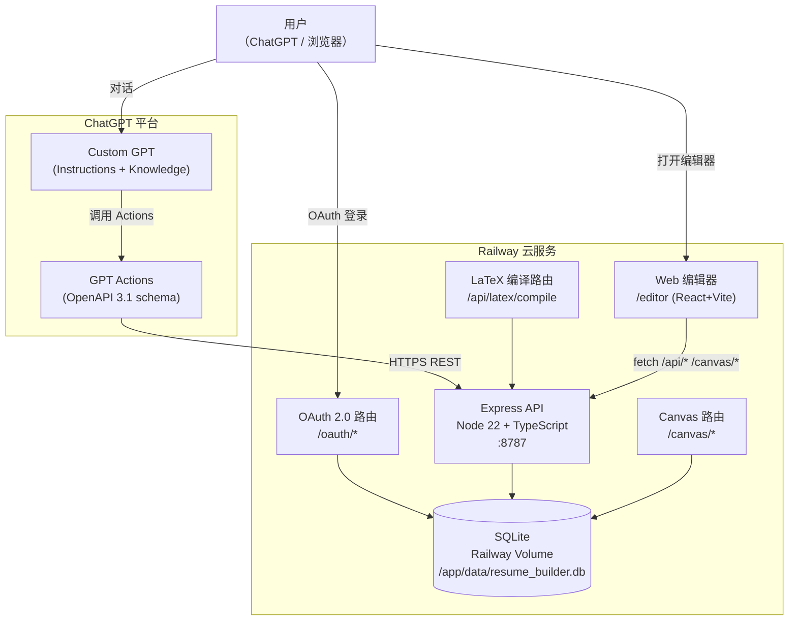

# Good Old Resume — 产品完整文档

> 最后更新：2026 年 4 月

---

## 目录

1. [产品定位](#一产品定位)
2. [系统架构](#二系统架构)
3. [用户使用链路](#三用户使用链路)
4. [已实现功能清单](#四已实现功能清单)
5. [部署与运维](#五部署与运维)
6. [待完善事项](#六待完善事项)
7. [评测基准（附录）](#七评测基准附录)

---

## 一、产品定位

**Good Old Resume** 是一套面向在校生与应届生的 AI 驱动简历优化系统。它以 ChatGPT Custom GPT 为主要交互入口，将用户的个人经历存储为结构化「模块」，并在用户提供目标岗位 JD 时，自动调取最匹配的模块组合成一份量身定制的简历，最终通过服务端 XeLaTeX 引擎编译为可下载的 PDF。

### 核心价值主张

| 维度 | 说明 |
|------|------|
| **模块化存储** | 将每段经历拆解为「子模块 + bullet 条目」分别存库，不同 JD 共享同一份经历库 |
| **JD 智能匹配** | 基于标签重叠与评分模型，从库中挑选最相关的模块与 bullet |
| **服务端编译** | XeLaTeX + xeCJK 运行在 Railway 容器内，用户无需在本地安装任何工具 |
| **中英文双模板** | 英文模板与中文模板（Fandol/Noto 字体）同时维护，GPT 自动选择 |
| **多用户隔离** | 自建 OAuth 2.0，每位用户数据严格隔离，支持公开分享使用 |

### 产品入口

- **主入口**：ChatGPT Custom GPT（名称：Good Old Resume）
- **辅助入口**：Web 编辑器（`/editor`）用于 LaTeX 精调；经历库（`/editor?view=modules`）用于直接管理经历数据

---

## 二、系统架构

### 2.1 组件关系图



### 2.2 技术栈

| 层次 | 技术 |
|------|------|
| GPT 接口 | ChatGPT Custom GPT + Actions（OpenAPI 3.1.0） |
| 后端运行时 | Node.js 22、TypeScript、Express.js |
| 数据库 | SQLite（`better-sqlite3`），WAL 模式 |
| 认证 | 自建 OAuth 2.0（`bcryptjs` 哈希，`crypto.randomUUID` 令牌） |
| LaTeX 引擎 | XeLaTeX + `texlive-lang-chinese` + `fonts-noto-cjk` |
| 前端编辑器 | React 18、Vite、CodeMirror 6（语法高亮） |
| 部署 | Docker（三阶段构建）+ Railway |
| 持久化存储 | Railway Volume，挂载于 `/app/data` |

### 2.3 目录结构（关键部分）

```
resume/
├── server/src/
│   ├── api.ts               # Express 主应用，路由注册
│   ├── templates.ts         # 英文 / 中文 LaTeX 模板字符串
│   ├── db/
│   │   ├── schema.ts        # 建表 DDL + 迁移函数
│   │   ├── client.ts        # 所有 CRUD 操作
│   │   ├── init.ts          # 容器启动时初始化 DB
│   │   └── seed.ts          # 种子数据（taxonomy、exemplar）
│   ├── routes/
│   │   ├── oauth.ts         # OAuth 授权 / 登录 / 注册 / 令牌
│   │   ├── latex.ts         # LaTeX 编译 + PDF 下载
│   │   └── canvas.ts        # Canvas 草稿 CRUD
│   ├── middleware/
│   │   └── auth.ts          # Bearer token 鉴权中间件
│   └── types/               # Zod schema + TypeScript 接口
├── editor/                  # React + Vite 前端
│   └── src/
│       ├── App.tsx          # LaTeX 编辑器主界面
│       ├── api.ts           # 前端 API 客户端
│       └── components/
│           ├── ModuleLibrary.tsx   # 经历库管理页面
│           ├── LaTeXEditor.tsx     # CodeMirror 编辑器
│           └── PDFPreview.tsx      # PDF 预览组件
├── openapi.yaml             # GPT Actions schema（11 个操作）
├── custom_gpt_instructions_compact.md   # GPT 指令（上传到 ChatGPT）
├── Dockerfile               # 三阶段构建
└── product_guide.md         # 本文档
```

### 2.4 数据库表结构

```
users              — 用户账户（user_id, email, password_hash）
auth_tokens        — OAuth 令牌（access / refresh / code，含过期时间）
jd_schemas         — 结构化 JD（含 hard/soft requirements、evidence_targets）
resume_modules     — 经历子模块（organization, title, section, location 等）
bullets            — bullet 条目（raw_fact, evidence/skill/role_fit tags, 评分）
exemplars          — 优质 bullet 样例库（用于风格参考，全局共享）
taxonomy_signals   — 技能信号分类词典（用于 matchModules 扩展匹配）
canvas_drafts      — LaTeX 草稿（draft_id, title, latex_source，用户隔离）
```

所有用户数据表均以 `(user_id, primary_key)` 为复合主键，彻底隔离不同用户的数据。

---

## 三、用户使用链路

### 3.1 注册与登录（首次使用）

1. 用户在 ChatGPT 中打开 Good Old Resume GPT，触发任意 GPT Action。
2. ChatGPT 检测到未授权，跳转至 OAuth 授权页：`https://<host>/oauth/authorize`。
3. 用户在该页面**注册**（填写邮箱 + 密码，密码 ≥ 8 位）或**登录**（已有账户）。
4. 服务端验证通过后，生成一次性授权码（`code`，有效期 5 分钟），重定向回 ChatGPT。
5. ChatGPT 用授权码换取 access_token（有效期 **1 小时**）和 refresh_token（有效期 **30 天**）。
6. 后续所有 Action 调用均在请求头中携带 `Authorization: Bearer <access_token>`。

> **注意**：access_token 过期后，ChatGPT 会尝试用 refresh_token 自动续期。若 refresh_token 也过期，需重新触发 OAuth 流程（通常表现为 GPT 提示重新登录）。

### 3.2 首次上传简历（建立经历库）

```
用户粘贴简历文字或上传 PDF
    │
    ▼
GPT 读取内容，识别各段经历
    │
    ▼
GPT 在 Canvas 中生成结构化草稿（Markdown 格式）
    │
    ▼
用户在 Canvas 中与 GPT 协作修改（增删 bullet、调整措辞）
    │
    ▼
用户确认内容 → GPT 调用 storeModules
    │
    ▼
后端解析 modules + bullets → 存入 SQLite
    │
    ▼
GPT 返回模块数量统计，提示后续可针对 JD 生成简历
```

**Canvas Markdown 格式约定**（GPT 使用的草稿格式）：

```markdown
# 姓名
邮箱 | 电话 | LinkedIn

## 实习经历
**公司名** | 职位 | 城市，国家 | 开始年月 – 结束年月
- bullet 条目一
- bullet 条目二
```

### 3.3 针对 JD 定制简历（核心工作流）

```
用户提供 JD（粘贴文字或描述岗位）
    │
    ▼
GPT 提取：role_title / company / hard_requirements /
          soft_requirements / domain_tags / evidence_targets
    │
    ▼
调用 storeJd → 持久化结构化 JD
    │
    ▼
调用 matchModules（传入 job_id）
    │
    ▼
后端评分：tag 重叠 × 1.5 + base_priority × 2 + bullet 平均评分
    │
    ▼
返回 ranked_modules（按 score 降序，最多 5 个模块）
    │
    ▼
GPT 用匹配结果拼装简历草稿（Canvas）
    │
    ▼
调用 getLatexTemplate / getLatexTemplateCn（按内容语言自动选择）
    │
    ▼
GPT 填充模板占位符，调用 compileLatex
    │
    ▼
后端：XeLaTeX 编译 → 生成 PDF → 存入内存缓存（30 分钟）
    │
    ▼
返回 pdf_url（UUID 作为能力 token，无需额外鉴权）
    │
    ▼
GPT 展示下载链接 + 完整 LaTeX 源码
```

> **模板选择规则**：用户内容主体为中文（中文姓名、中文 bullet、中文 JD）→ `getLatexTemplateCn`；否则 → `getLatexTemplate`。两套模板均存于服务端 `server/src/templates.ts`，GPT **不从 Knowledge 文件重建模板**。

### 3.4 经历库管理（Web UI）

1. 在 ChatGPT 中请求「打开经历库」→ GPT 调用 `getEditorLink`。
2. 后端返回预构建的 URL：`https://<host>/editor?token=<access_token>&view=modules`。
3. 用户点击链接，浏览器打开独立网页（React 应用）。
4. 页面按分类（教育背景 / 实习经历 / 项目经历 / 校园经历 / 竞赛经历 / 技能）展示所有子模块。
5. 支持的操作：
   - **点击编辑**：点击任意文字字段，即时变为输入框，失焦自动保存（`PATCH /api/modules/:id`）
   - **添加子模块**：分类标题右侧「＋ 添加子模块」按钮
   - **删除子模块**：子模块卡片右上角 `⋯` 菜单 → inline 确认删除
   - **添加 bullet**：每个子模块底部常驻「＋ 添加经历条目」
   - **删除 bullet**：hover 显示右侧 `−` 按钮 → inline 确认
   - **拖拽排序**：每条 bullet 右侧 `≡` 手柄，按住拖动，其他 bullet 动画让位
   - **撤销 / 重做**：工具栏 ↺ ↻ 按钮，或 `Ctrl+Z` / `Ctrl+Shift+Z`
   - **添加 / 删除分类**：页面底部「＋ 添加分类」按钮，分类标题右侧「× 删除分类」

### 3.5 LaTeX 编辑器（Canvas 模式）

1. 在 ChatGPT 中请求「打开编辑器」→ GPT 调用 `getEditorLink`，获取 `editor_url`。
2. 用户在浏览器打开 `/editor?token=<token>`（若有草稿 ID 则追加 `&draft=<draft_id>`）。
3. 编辑器界面：左侧 CodeMirror（LaTeX 语法高亮），右侧 PDF 预览。
4. 支持的操作：
   - 加载中文 / 英文模板（「模板 (中文)」/「Template (EN)」按钮）
   - 手动编辑 LaTeX 源码
   - 点击「Compile →」调用后端编译，右侧实时更新 PDF 预览
   - 「↓ Download PDF」直接下载
   - 草稿自动保存（编辑停止 2 秒后），「My Drafts」可查看历史草稿

---

## 四、已实现功能清单

### 4.1 GPT Actions（11 个）

| Action | 端点 | 说明 |
|--------|------|------|
| `storeModules` | `POST /api/modules` | 存储模块 + bullet |
| `listModules` | `GET /api/modules` | 列出所有模块（含 bullet） |
| `getModule` | `GET /api/modules/:id` | 获取单个模块详情 |
| `deleteModule` | `DELETE /api/modules/:id` | 删除模块及其 bullet |
| `storeJd` | `POST /api/jd` | 存储结构化 JD |
| `listJds` | `GET /api/jd` | 列出所有已存 JD |
| `matchModules` | `POST /api/match` | JD 匹配，返回评分排序的模块列表 |
| `getLatexTemplate` | `GET /api/template/latex` | 获取英文 LaTeX 模板 |
| `getLatexTemplateCn` | `GET /api/template/latex/zh` | 获取中文 LaTeX 模板 |
| `compileLatex` | `POST /api/latex/compile` | 编译 LaTeX → PDF URL |
| `getEditorLink` | `GET /api/auth/editor-link` | 获取带 token 的编辑器 / 经历库 URL |

### 4.2 后端 API 路由全览

**公开路由（无需鉴权）**

| 方法 | 路径 | 说明 |
|------|------|------|
| `GET` | `/` | 健康检查，返回版本信息 |
| `GET` | `/privacy` | 隐私政策页面（HTML） |
| `GET` | `/oauth/authorize` | OAuth 授权入口（显示登录/注册页） |
| `POST` | `/oauth/login` | 处理登录表单 |
| `POST` | `/oauth/register` | 处理注册表单 |
| `POST` | `/oauth/token` | 授权码 / refresh_token 换 access_token |
| `GET` | `/api/template/latex` | 获取英文 LaTeX 模板 |
| `GET` | `/api/latex/pdf/:id` | 下载已编译 PDF（UUID 作为 capability token） |

**鉴权路由（Bearer token 必填）**

| 方法 | 路径 | 说明 |
|------|------|------|
| `GET` | `/api/auth/editor-link` | 生成含 token 的编辑器 URL |
| `GET` | `/api/template/latex/zh` | 中文模板（鉴权路由，可调整） |
| `POST` | `/api/modules` | 存储模块 + bullet |
| `GET` | `/api/modules` | 列出所有模块 |
| `GET` | `/api/modules/:id` | 获取单模块 |
| `PATCH` | `/api/modules/:id` | 更新模块字段 |
| `DELETE` | `/api/modules/:id` | 删除模块（级联删除 bullet） |
| `PATCH` | `/api/modules/:mid/bullets/:bid` | 更新单条 bullet |
| `DELETE` | `/api/modules/:mid/bullets/:bid` | 删除单条 bullet |
| `POST` | `/api/jd` | 存储 JD |
| `GET` | `/api/jd` | 列出所有 JD |
| `GET` | `/api/jd/:id` | 获取单个 JD |
| `POST` | `/api/match` | 模块匹配 |
| `POST` | `/api/latex/compile` | LaTeX 编译 |
| `GET` | `/canvas/drafts` | 列出草稿 |
| `GET` | `/canvas/draft/:id` | 获取草稿 |
| `POST` | `/canvas/draft` | 创建 / 更新草稿 |
| `DELETE` | `/canvas/draft/:id` | 删除草稿 |

**管理员路由（`ADMIN_SECRET` Bearer token）**

| 方法 | 路径 | 说明 |
|------|------|------|
| `GET` | `/admin/health` | 数据库文件状态 |
| `GET` | `/admin/users` | 用户列表 |
| `DELETE` | `/admin/users/:userId` | 删除用户 |
| `GET` | `/admin/stats` | 各表行数统计 |
| `GET` | `/admin/db/download` | 下载 SQLite 文件 |

### 4.3 LaTeX 编译能力

- 编译器：**XeLaTeX**（`xelatex -interaction=nonstopmode -halt-on-error`）
- 中文支持：`xeCJK` + `texlive-lang-chinese` + `fonts-noto-cjk`
- 英文模板字体：系统默认衬线字体
- 中文模板字体：**Fandol** 系列（FandolSong / FandolHei / FandolKai，TeX Live 内置）
- 编译超时：60 秒
- 结果缓存：PDF 存于进程内存 Map，30 分钟后自动清除
- 容器启动时预热字体缓存（`fc-cache -fv` + warmup 编译），大幅减少首次编译延迟

### 4.4 经历库 UI 技术亮点

- **InlineEdit**：点击文字即原地进入输入框，失焦自动调用 `PATCH` API 保存，`Esc` 取消
- **Pointer Events 拖拽**：完全自实现（非 HTML5 Drag API），原始元素保持完全可见，浮动 ghost 跟随鼠标，其他 bullet 以 CSS `transform + transition` 动画平滑让位
- **InlineConfirm**：删除操作的 inline 确认（`确认？ ✓ 取消`），替代浏览器原生 `confirm()` 弹窗
- **本地撤销 / 重做**：React `useRef` 维护快照历史栈，不依赖后端接口，支持键盘快捷键

---

## 五、部署与运维

### 5.1 Docker 构建流程

Dockerfile 采用**三阶段**构建：

```
阶段 1 — builder
  └── 编译 TypeScript → /app/dist/
  └── 复制种子数据至 /seed-data/

阶段 2 — editor-builder
  └── npm ci 安装前端依赖
  └── vite build → /editor-dist/

阶段 3 — runtime（最终镜像）
  └── 安装 texlive-xetex + 中文包（约 600MB）
  └── 预热 fontconfig + xelatex 字体缓存
  └── 复制 dist/ + seed-data/ + editor-dist/
  └── 启动命令：init.js → seed.js → api.js
```

### 5.2 Railway 部署配置

- **Volume**：挂载路径 `/app/data`，SQLite 文件路径 `/app/data/resume_builder.db`
- **种子数据**：容器内 `/app/seed-data/` 存放 taxonomy + exemplar，每次启动由 `seed.js` 检查并写入（不覆盖已有用户数据）
- **端口**：默认 `8787`，Railway 自动转发

### 5.3 关键环境变量

| 变量名 | 必填 | 说明 |
|--------|------|------|
| `OAUTH_CLIENT_ID` | 是 | OAuth client_id，需与 GPT Actions 配置一致 |
| `OAUTH_CLIENT_SECRET` | 是 | OAuth client_secret |
| `ADMIN_SECRET` | 推荐 | 管理员 API 的 Bearer token |
| `CANVAS_ENABLED` | 否 | 设为 `true` 时启用 `/editor` + `/canvas` 路由（默认关闭） |
| `PUBLIC_BASE_URL` | 否 | 覆盖 PDF URL 的 base，如 `https://resume-builder-production-229e.up.railway.app` |
| `PORT` | 否 | 监听端口，默认 `8787` |
| `PDFLATEX_CMD` | 否 | LaTeX 编译器命令，默认 `xelatex` |

### 5.4 Admin 工具使用（curl 示例）

所有管理员接口均需在请求头携带 `Authorization: Bearer <ADMIN_SECRET>`。

```bash
# 健康检查
curl -H "Authorization: Bearer $ADMIN_SECRET" \
  https://resume-builder-production-229e.up.railway.app/admin/health

# 查看所有用户
curl -H "Authorization: Bearer $ADMIN_SECRET" \
  https://resume-builder-production-229e.up.railway.app/admin/users

# 各表统计
curl -H "Authorization: Bearer $ADMIN_SECRET" \
  https://resume-builder-production-229e.up.railway.app/admin/stats

# 下载完整数据库文件（用于备份或本地调试）
curl -H "Authorization: Bearer $ADMIN_SECRET" \
  -o resume_builder_backup.db \
  https://resume-builder-production-229e.up.railway.app/admin/db/download

# 删除指定用户（及其所有数据）
curl -X DELETE \
  -H "Authorization: Bearer $ADMIN_SECRET" \
  https://resume-builder-production-229e.up.railway.app/admin/users/<user_id>
```

### 5.5 GPT Configure 需要填写的内容

在 ChatGPT GPT 编辑器的 Configure 页面需要配置：

1. **Instructions**：内容来自 `custom_gpt_instructions_compact.md`（约 7500 字符）
2. **Knowledge 文件**：
   - `resume_style_guide_v2.md`：风格规范参考
   - `action_verbs`（可选）：动词库
3. **Actions**：上传 `openapi.yaml`，配置 OAuth：
   - Client ID：与 `OAUTH_CLIENT_ID` 一致
   - Client Secret：与 `OAUTH_CLIENT_SECRET` 一致
   - Authorization URL：`https://<host>/oauth/authorize`
   - Token URL：`https://<host>/oauth/token`
   - Privacy Policy URL：`https://<host>/privacy`

---

## 六、待完善事项

### 高优先级

| 问题 | 根因 | 建议修复方向 |
|------|------|------------|
| **Bullet 排序不持久化** | `resume_modules` 表无 `bullet_order` 列，UI 排序仅为本地状态，刷新即丢失 | 在 `bullets` 表增加 `sort_order` 整数列；`PATCH /api/modules/:mid/bullets/:bid` 支持更新排序；UI 在拖拽松手时批量提交 |
| **PDF 存内存，重启失效** | PDF 编译结果存于 `pdfStore`（进程内 Map），服务重启后 URL 立即失效 | 编译后将 PDF 写入 Volume（如 `/app/data/pdf/<uuid>.pdf`），提供一个清理 cron 任务，下载路由直接读文件 |
| **Access token 过期需重新登录** | access_token 有效期仅 1 小时；ChatGPT 的 OAuth 实现有时无法自动用 refresh_token 续期 | 可将 access_token 有效期延长至 24 小时，降低触发频率；或在 GPT Instructions 中指导用户遇到鉴权失败时重新触发任意 Action |

### 中优先级

| 问题 | 说明 |
|------|------|
| **无邮箱验证** | 注册时不验证邮箱真实性，任意字符串均可注册 |
| **无 API 限速** | 后端未配置 Rate Limiting，高频调用（如批量 `storeModules`）可能造成资源压力 |
| **Context tags 在 UI 中不可编辑** | 经历库 UI 中，标签（`finance`、`consulting` 等）由 GPT 存入，在网页端只读显示，无法手动增删 |
| **Exemplar 库依赖人工维护** | `exemplars` 表当前只有 `data/seed/sample_exemplars.json` 中的少量样例，`matchModules` 的 exemplar 召回实际不影响主要评分，效果待验证 |
| **模板选择无回退机制** | 若 `getLatexTemplate(Cn)` 接口调用失败，GPT 可能尝试从内存重建模板，导致格式错误 |

### 低优先级 / 功能扩展

| 功能 | 说明 |
|------|------|
| **账户管理页面** | 目前无任何前端界面用于修改密码、查看账户信息或申请注销；只能由管理员通过 `/admin/users/:id` 删除 |
| **Admin Web UI** | 管理员功能全部依赖 curl，操作不便；可在 `/editor` 基础上增加一个 admin 视图 |
| **简历版本历史** | `canvas_drafts` 表已存在，但没有「版本对比」或「回滚到某次编译」的界面 |
| **协作 / 分享** | 无法将简历草稿分享给他人审阅（如导师、职业顾问） |
| **模块导出** | 经历库目前无法一键导出为 LaTeX / Word / JSON，需通过 GPT 手动触发 |
| **移动端体验** | Web 编辑器（经历库 + LaTeX 编辑器）未针对移动端布局优化 |

---

## 七、评测基准（附录）

目录：`resume_eval_benchmark_v1/`

### 7.1 设计目标

为系统建立一套**可复现的评测流程**，使用合成数据（非真实用户信息）即可快速跑通，后续可用真实数据替换。

### 7.2 内容构成

| 文件 / 目录 | 内容 |
|------------|------|
| `profiles.jsonl` | 6 个合成候选人档案，涵盖不同专业背景 |
| `baseline_resumes/P01–P06.md` | 6 份通用基线简历（未针对 JD 定制） |
| `jd_library.jsonl` | 12 份合成 JD，覆盖咨询、战略、产品、数据、金融、研究、ML 七个方向 |
| `jd_texts/J01–J12.md` | JD 的 Markdown 可读版本 |
| `tasks.jsonl` | 24 个评测任务（候选人 × JD 组合），含预期关注点与常见失误模式 |
| `task_manifest.csv` | 任务总览表格 |
| `rubric.md` | 评分维度说明 |
| `blind_scoring_sheet.csv` | 五臂盲评打分表（A–E 臂） |
| `process_audit_sheet.csv` | 模块选择合理性、规则合规性、夸大程度审计表 |

### 7.3 五臂评测设计

| 臂 | 说明 |
|----|------|
| **A** | 原始通用基线简历（对照组） |
| **B** | Vanilla ChatGPT 直接改写（无任何系统提示） |
| **C** | Good Old Resume 完整系统（本产品） |
| **D** | 消融实验：移除某个关键模块后的结果 |
| **E** | 第二消融 / 人工编辑对照 |

### 7.4 推荐首批测试任务

首批建议运行以下 8 个任务，覆盖主要岗位类型与地区规则：

```
T01, T02, T05, T06, T09, T13, T17, T23
```

涵盖：咨询 / 产品 / 数据分析 / 金融 / ML / 综合型岗位，以及美国 / 英国 / 欧洲 / 亚太地区规则。

### 7.5 当前状态

评测基准已完整构建但**尚未系统运行**。建议在产品功能稳定后，按照 `benchmark_summary.md` 中的流程组织一次完整的盲评，并将结果存入 `blind_scoring_sheet.csv` 用于后续版本对比。

---

*文档完。如需更新，请在对应章节直接修改，并更新文档顶部的「最后更新」日期。*
